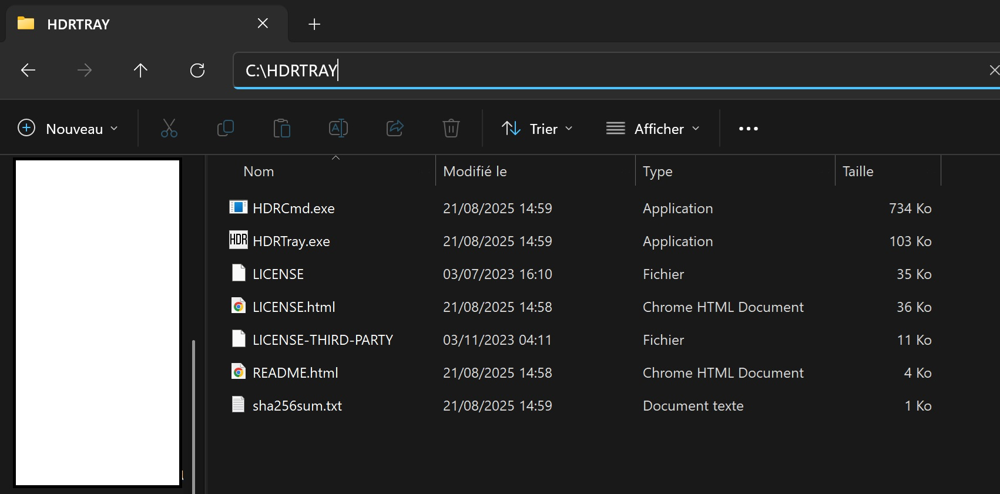
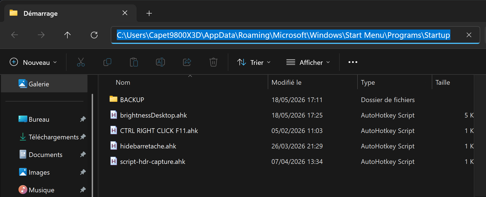

# windows-brightness-master

[Version francaise](README.fr.md)

[AutoHotkey v2](https://www.autohotkey.com/) scripts for Windows brightness, gamma, and HDR shortcuts.

Each script has a dedicated purpose. Do not mix scripts unless you explicitly want all related hotkeys to run at startup.

## Requirements

Install AutoHotkey v2:

- https://www.autohotkey.com/

For HDR toggling, install HDRTray from the official GitHub repository:

- https://github.com/res2k/HDRTray

Put the HDRTray command-line helper in:

```text
C:\HDRTRAY
```



Required for the HDR toggle script:

- `HDRCmd.exe`

Optional:

- `HDRTray.exe` if you also want the notification-area icon.

## Desktop/brightnessDesktop.ahk

Desktop monitor visual brightness correction.

Use this script on desktop monitors when hardware brightness control is unavailable or unreliable. It works in SDR and HDR, but gamma behavior can depend on the Windows HDR pipeline, GPU driver, and app/game.

Features:

- Black click-through overlay to visually reduce brightness.
- Gamma boost to lift dark pages when HDR/local dimming makes them too dim.
- Gamma reset when the script exits.

Hotkeys:

| Hotkey | Action |
| --- | --- |
| `Ctrl+Alt+Up` | Reduce black overlay |
| `Ctrl+Alt+Down` | Increase black overlay |
| `Ctrl+Shift+Alt+Up` | Increase gamma boost by `0.5` |
| `Ctrl+Shift+Alt+Down` | Decrease gamma boost by `0.5` |
| `Ctrl+Shift+Alt+0` | Reset overlay and gamma |

Notes:

- The overlay is not a hardware brightness change.
- Gamma boost uses the Windows/GDI gamma ramp.
- Before gaming, use `Ctrl+Shift+Alt+0` if you want a fully reset image.

Installation:

1. Copy `Desktop/brightnessDesktop.ahk` to `shell:startup`.
2. Double-click it once, or restart Windows.

## Laptop/brightnessLaptop.ahk

Laptop internal display brightness only.

Use this script only on laptops with an internal panel exposed through the Windows WMI brightness API.

Features:

- Uses `WmiMonitorBrightness`.
- Uses `WmiMonitorBrightnessMethods`.
- Does not touch gamma.
- Does not create overlays.
- Does not control HDR.
- Does not control external monitor brightness.

Hotkeys:

| Hotkey | Action |
| --- | --- |
| `Ctrl+Alt+Up` | Laptop brightness +5% |
| `Ctrl+Alt+Down` | Laptop brightness -5% |

Installation:

1. Copy `Laptop/brightnessLaptop.ahk` to `shell:startup`.
2. Double-click it once, or restart Windows.

## HDR/hdrToggle.ahk

Windows HDR toggle shortcut.

Use this script when you want a direct keyboard shortcut to turn Windows HDR on or off without relying on Xbox Game Bar.

This is useful on Windows PCs where Game Bar has been fully disabled or removed, especially if these processes are disabled:

- `Gamebar.exe`
- `GameBarFTServer.exe`

If Game Bar is removed, the usual Windows overlay shortcuts are no longer available. This script keeps HDR toggling available through `HDRCmd.exe` from HDRTray.

Hotkeys:

| Hotkey | Action |
| --- | --- |
| `Ctrl+Alt+B` | Toggle Windows HDR on/off |

Installation:

1. Download HDRTray from https://github.com/res2k/HDRTray.
2. Put `HDRCmd.exe` in `C:\HDRTRAY`.
3. Copy `HDR/hdrToggle.ahk` to `shell:startup`.
4. Double-click it once, or restart Windows.

Optional Game Bar removal command:

```powershell
Get-AppxPackage -AllUsers Microsoft.XboxGamingOverlay | Remove-AppxPackage
```

Run that command in an administrator PowerShell only if you intentionally want to remove Xbox Game Bar.

## HDR/hdrScreenshotSafe.ahk

HDR-safe Windows screenshot shortcut.

Use this script when HDR screenshots look wrong, washed out, overexposed, or color-shifted. It turns HDR off before launching the Windows snipping shortcut.

This script is separate from `HDR/hdrToggle.ahk` on purpose:

- `HDR/hdrToggle.ahk` only toggles HDR with `Ctrl+Alt+B`.
- `HDR/hdrScreenshotSafe.ahk` only prepares screenshots with `Win+Shift+S`.

Hotkeys:

| Hotkey | Action |
| --- | --- |
| `Win+Shift+S` | Turn HDR off, wait briefly, then launch Windows snipping |

Installation:

1. Download HDRTray from https://github.com/res2k/HDRTray.
2. Put `HDRCmd.exe` in `C:\HDRTRAY`.
3. Copy `HDR/hdrScreenshotSafe.ahk` to `shell:startup`.
4. Double-click it once, or restart Windows.

## Startup Folder

Open the Windows Startup folder with:

```text
Win+R
shell:startup
```

Copy only the scripts you actually want to run at login.


